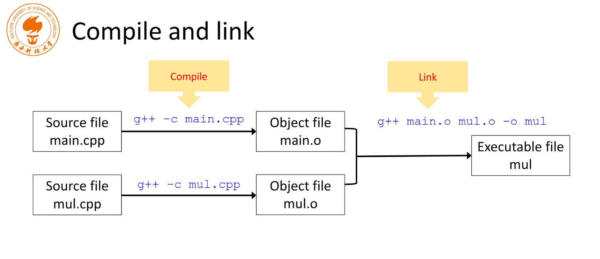
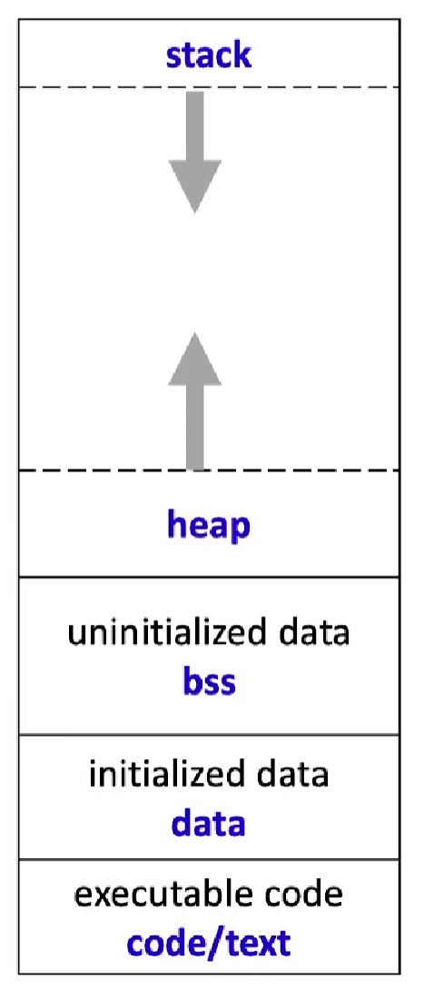
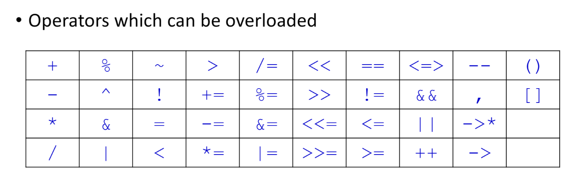

# Chapter1 Introduction and Background

> 第一章、基础知识

## g++

1、编译 hello.cpp 文件：

```bash
g++ hello.cpp
```

2、使用 c++11：

```bash
g++ hello.cpp --std=c++11
```

3、自定义生成文件名：

```bash
g++ hello.cpp --std=c++11 -o hello
```

4、运行生成的文件：

```bash
./hello
```

## Compile and Link

函数声明一般放在 `*.hpp` 文件中

分门别类管理，节约编译时间，条理清晰

```c++
// main.cpp
#include <iostream>
#include "mul.hpp"
using namespace std;
int main() {
    int a, b;
    int result;
    cout << "Pick two integers:";
    cin >> a;
    cin >> b;
    result = mul(a, b);
    cout << "The result is " << result << endl;
    return 0;
}

// mul.hpp
#pragma once

int mul(int a, int b);

// mul.cpp
#include "mul.hpp"
int mul(int a, int b) {
    return a * b;
}
```



注：g++ 的 -c 选项表示只编译不链接。

好处：分开编译，**节约编译时间**

**引号和尖括号引用的区别**

- 尖括号：编译器从编译器指定的 include 路径寻找头文件
- 引号：从指定的和当前路径寻找

## Debug

错误三大类：

- 编译错误：编译时就出错了，一般由语法造成
- 链接错误：错误提示一般与 symbol 有关，顺藤摸瓜查这个符号
- 运行错误：编译链接正常，运行时报错

## Preprocessor and Macros

预处理指令是以“#”开头的指令，只能占一行，换行需要转义符

## Simple Input and Output

```c++
std::ostream cout;
std::istream cin;
```

`<<` 是运算符，采用运算符重载定义，返回值依然是 `cout`，故可以链式调用

## Arguments

```c++
// arguments.cpp
```


# Chapter2 Data Types and Arithmetic Operations

> 第二章、数据类型及算术运算
>
> 整形类型，浮点类型，算数运算，类型转换

## Integer Numbers

Please initialize variables **EXPLICITLY**!

新的初始化方式

```c++
int num (10);
int num {10};
```

## Data Width and More Integer Types

C 和 C++ 标准并未固定数据位宽

`long long int` 保证 64 位

`sizeof` 是 `operator`，因为函数的参数必须是变量

c++标准并没有规定char（-128~127）表示unsigned char（0~255）还是signed char。不同平台不一样。

从c++11开始增加了 char16\_t（16位的char）、char32\_t（32位的char） 类型，可以表示中文字符。

```c++
char 16_t c = u'于';
char 32_t c = U'于';
```

字符类型前面添加 `+` 会隐式转换为整数

```c++
bool b = true;
int i = b; // the value of i is 1
bool b = -256; // 非0值均为1 unrecommended conversion
bool b = (-256 != 0); // better choice
```

## Boolean in C

```c
typedef char bool;
#define true 1
#define false 0

#include <stdbool.h>
```

## $\texttt{size\_t}$

`sizeof` 的返回值类型

表达内存、表达元素的个数等等

自减时不会减到负数，循环时不能自减，否则会无限循环

## Fixed Width Integer Types (since C++11)

```c++
// Defined in <cstdint>
int8_t;
int16_t;
int32_t;
int64_t;
uint8_t;
uint16_t;
uint32_t;
uint64_t;
...

// Some useful macros
INT8_MIN;
INT16_MIN;
INT32_MIN;
INT64_MIN;
INT8_MAX;
INT16_MAX;
INT32_MAX;
INT64_MAX;
...
```

## Floating Point Numbers

```cpp
#include <iostream>
#include <iomanip>
using namespace std;
 
int main(int argc, char *argv[]) {
    float f1 = 1.2f;
    float f2 = f1 * 1000000000000000; //1.0e15
    cout << std::fixed << std::setprecision(15) << f1 << endl;
    cout << std::fixed << std::setprecision(15) << f2 << endl;
}
```

原因在于小数是无限的，计算机表示数据有位数限制。写一个很长的小数，计算机不一定能表示出来。所以计算机表示浮点数的时候进行了采样。比如上面要表示一个15位有效数字的1.2，得到的是计算机在那段范围进行了采样后的结果。

如果支持 `long double`，则为 128 位。半精度是深度学习中大量使用的，但是不属于 C++ 标准

double 类型的数据操作比 float 更慢。

## Constant Numbers

```c++
95; // decimal
0137; // octal
0x5F; // hexadecimal
95; // int
95u; // unsigned int
95l; // long
95ul; // unsigned long
95lu; // unsigned long

6.02e23L; // long double
```

## $\texttt{auto}$

`auto` is placeholder type specifier

```c++
auto a = 2; // int
auto bc = 2.3; // double
auto c; // valid in C, error in C++
auto d = a * 1.2; // double

// Question
auto a = 2;
a = 2.3; // will a be converted to double again? No
```

## Conversion

```c++
int num1 = (int)'C'; // C-style
int num2 = int('C'); // function style
```

```c++
float f = 17 / 5; // f will be 3.f
```


# Chapter3 Statements

> 第三章、语句

## Assign Statement

```cpp
if(int * p = get()){}
```

赋值表达式的值是等号右边的内容。

## $\texttt{goto}$

在函数的末尾进行错误处理、清理等操作。当程序出错时跳转到错误处理的相关代码，其他情况不建议使用 goto 语句。

## $\texttt{switch}$

更像 goto 语句，所以要注意写 break


# Chapter4 Arrays

> 数组
>
> 数组（一维数组，定长数组，变长数组，多维数组，常量数组等等，字符串string），结构体(struct)【将不同的数据类型统一起来，用法基本上同后面学到的类】，联合体（union）【共享同一块地址】以及枚举（enum）[替换常量],

## Variable-length Arrays

运行时才能确定数组的大小，如果用常量开，编译时便可确定

不一定能够直接初始化

C 和 C++ 禁止数组首地址的赋值，这样两个数组地址指向同一块内存，有一个数组丢失

循环逐个赋值或者内存拷贝函数赋值

无越界检查

在 C/C++ 中数组不是对象，这点不同于 Java

## $\texttt{const}$ arrays

常常用作函数传参

```cpp
const wchat_t[] s1 = L"ABCD";
const char16_t[] s2 = u"ABCD";
const char32_t[] s3 = U"ABCD";
```

```cpp
char *strcpy(char* dst, const char* src);
```

如果溢出了也会继续复制，所以有了更安全的 `strncpy`

## $\texttt{string}$ class

```cpp
std::string str1 = "Hello";
std::string str2 = "Lee";
std::string result = str1 + ", " + str2;
```

## Different Types of $\texttt{string}$

```cpp
std::string
std::wstring
std::u8string // C++20
std::u16string // C++11
std::u32string // C++11
```

直接用方括号下标访问不会有异常，at 方法越界会有异常

## $\texttt{struct}$

```cpp
struct Point point1 = {.type=TYPE_INT8, .data8={-2,3,4}};
```

## $\texttt{enum}$

```cpp
enum color {WHITE, BLACK, RED, GREEN, BLUE, YELLOW, NUM_COLORS};
enum color pen_color = RED;
pen_color = color(3); // type convertion
pen_color += 1; // ERROR!
int color_index = pen_color;
color_index += 1;
```

## $\texttt{typedef}$

```cpp
typedef unsigned char vec3b[3];

unsigned char color[3];
vec3b color = {255, 0, 255};
```


# Chapter5 Pointers and Memory Management

> 第五章、指针与内存管理

## Constant Pointers

指针指向的内容不能通过 `*` 取内容来修改

```cpp
int num = 1;

// You cannot change the value p1 points to through p1
const int * p1 = &num;
*p1 = 3; // error
num = 3; // okay

// You cannot change the value of p2
int * const p2 = &num;
*p2 = 3; // okay
int another = 2;
p2 = &another; // error

// You cannot change either of them
const int* const p3 = &num;
// But you can still change num directly
```

```cpp
int foo(const char *p) {
    // play a trick to remove const restriction?
    char * p2 = p; // syntax error
    // You cannot assign a const pointer to non-const one
    // ...
    return 0;
}
```

## $\texttt{size\_t}$

一个无符号整型，表示当前系统内存中可以存储的最大对象的大小。

## Memory Types

-   代码区：存放程序的执行指令，试图写入的操作会被系统 kill。
-   静态变量区：初始化的、未初始化的分开存放。
-   堆内存区：动态申请的内存会存放此处，
-   栈内存区：临时、局部变量存放在此区。



## $\texttt{void* malloc( size\_t size )}$

-   单位是字节。
-   分配的内存是未初始化的，不改变原有存储内容。
-   存在内存对齐机制，比如：int \* p1 = (int\*) malloc (4);只想分配4字节，但是不同操作系统分配的是不同的，有的会最小分配4字节，有的会最小分配16字节。
-   **当程序结束后操作系统会把分配给该程序的所有内存回收。**

## Memory Leak

```c++
p = (int *) malloc(4 * sizeof(int));
// ...
p = (int *) malloc(8 * sizeof(int));
free(p);

void foo() {
    int *p = (int *) malloc(sizeof(int));
    return;
}
```

## $\texttt{new}$

> Operator new is similar with malloc() but with more features

```c++
//allocate an int, default initializer (do nothing)
int * p1 = new int; 
//allocate an int, initialized to 0
int * p2 =  new int();
//allocate an int, initialized to 5
int * p3 =  new int(5); 
//allocate an int, initialized to 0
int * p4 =  new int{};//C++11    
//allocate an int, initialized to 5
int * p5 =  new int {5};//C++11

//allocate a Student object, default initializer
Student * ps1 = new Student;
//allocate a Student object, initialize the members
Student * ps2 = new Student {"Yu", 2020, 1}; //C++11

//allocate 16 int, default initializer (do nothing) 
int * pa1 = new int[16];
//allocate 16 int, zero initialized 
int * pa2 = new int[16]();
//allocate 16 int, zero initialized 
int * pa3 = new int[16]{}; //C++11
//allocate 16 int, the first 3 element are initialized to 1,2,3, the rest 0
int * pa4 = new int[16]{1,2,3}; //C++11

//allocate memory for 16 Student objects, default initializer
Student * psa1 = new Student[16];
//allocate memory for 16 Student objects, the first two are explicitly initialized
Student * psa2 = new Student[16]{{"Li", 2000,1}, {"Yu", 2001,1}}; //C++11
```

## $\texttt{delete}$

```c++
//deallocate memory
delete p1;
//deallocate memory
delete ps1;

//deallocate the memory of the array
delete pa1;
//deallocate the memory of the array
delete []pa2;

//deallocate the memory of the array, and call the destructor of the first element
delete psa1;
//deallocate the memory of the array, and call the destructors of all the elements
delete []psa2;
```

养成用 `delete []` 的习惯是比较安全的


# Chapter6-7 Functions

> 第六章、函数
>
> 1、函数的定义
> 2、函数的返回值（本质就是值复制）
> 3、函数的参数（深拷贝与浅拷贝 也就是对应大的值传递还是地址传递地问题。最终在实际中的体现就是深拷贝在函数里面的修改会对外面的参数有影响。）
> 4、函数的声明与使用（通常函数编辑的时候，首先在入口处要对参数进行各种检查，这样可以避免出现BUG）
> 5、引用：相比较于指针，引用一定要初始化，会更加的安全。
> 6、内联函数，就是以空间换时间的作用；
>
> 第七章、函数的扩展：默认参数问题以及函数模板等等
> 1、默认参数都是从后面开始写的；
> 2、函数的重载：函数名相同，签名不同的函数，主要的作用就是在调用的时候能根据参数的传入不同，调用不同的函数体。
> 3、函数模板：本质上就是泛型，类似于C#中的泛型，在定义的时候是不会生成代码，在实例化的时候才生成真正的代码。 多态的本质就是延迟定义，这样可以让程序变得更加灵活。
> 4、函数指针： 就是指向函数的指针。 类似于C#中的委托，这样做到深层次可以实现事件进行异步通讯。
> 5、函数引用：
> 6、递归函数：优点就是可以让复杂程序变得简单，比如树的遍历等等；缺点就是占据内存高，计算复杂度高，同时耗时且理解困难。

The parameters should be checked first!!

好的风格是先声明，否则要不断调整函数的顺序

一般把函数的声明放在头文件里

## Function Calling

-   应用程序执行的时候实际上是二进制指令一条条地往CPU里面搬，每一段代码都是一条条指令。
-   当碰到函数时，因为函数的指令不一定和当前执行的指令放在一起的，那么在执行函数时会跳到其他位置去执行，在跳之前一般要保存当前的状态，即各种数据入栈。
-   执行完函数之后从栈中取出各种数据。拿到函数返回值（如果有），继续执行原来的代码。
-   程序执行的代价就是各种数据的出入栈的花费，如果函数非常复杂那么代价可以忽略不计，如果是简单的函数又频繁调用代价就大了，这时候可以设为内联函数。

## References

> an alias to an already-existing variable/object

- A reference **must** be initialized after its declaration.
- References are much safer.
- Affecting the original object, to avoid this, add `const` modifier.
- Higher efficiency without data copying.

## Multiple Return Values

- such as matrix addition function
- A suggested prototype
  - To use references to avoid data copying
  - To use const parameters to avoid input data being modified
  - To use non-const reference parameters to receive the output

## Inline Functions

- inline 只是对编译器的一种建议
- 内联后的代码大概如下：
  ```c++
  int main() {
      int num1 = 20;
      int num2 = 30;
      int maxv =
      { if (num1 > num2)
          return num1;
        else
          return num2; }
      maxv =
      { if (numn > maxv)
          return numn;
        else
          return maxv; }
  }
  ```

## Default Arguments

```c++
float norm(float x, float y, float z = 0);
// z is parameter, 0 is argument
```

只能从尾部开始，只能定义一次，效果可以叠加

## Function Overloading

返回值不参与比较，两个参数列表相同但返回值不同的函数被认为是同一个函数。

## Function Templates

编译器不会为模板函数生成机器指令，因为不知道具体的类型，只有模板实例化时才会生成机器指令。

函数模板实例化：

```cpp
template<typename T>
T sum(T x, T y) {
    cout << "The input type is " << typeid(T).name() << endl;
    return x + y;
}

// instantiates explictly
template double sum<double>(double, double);
template char sum<>(char, char);
template int sum(int, int);
```

## Specialization

特化

如对于结构类型：

```cpp
struct Point {
    int x;
    int y;
};
```

直接执行会报错，需要针对此类型进行特例化：

```cpp
template<>
Point sum<Point>(Point pt1, Point pt2) {
    cout << "The input type is " << typeid(pt1).name() << endl;
    Point pt;
    pt.x = pt1.x + pt2.x;
    pt.y = pt1.y + pt2.y;
    return pt;
}
```

注意此处必须加 `<>`

## Function Pointers

指向的是指令区的数据，指向指令的地址

有些时候需要用到代表某一类函数的函数指针，例如标准库容器的自定义操作

还有一种是把函数作为参数传入另一个函数作为**回调函数**，如 `qsort` 的调用

```c++
float norm_l1(float x, float y);
float norm_l2(float x, float y);
float (*norm_ptr)(float x, float y);
norm_ptr = norm_l1; // pointing
norm_ptr = &norm_l2;
float len1 = norm_ptr(-3.0f, 4.0f); // invoking
float len1 = (*norm_ptr)(-3.0f, 4.0f);
```

## Function References

```c++
float norm_l1(float x, float y);
float norm_l2(float x, float y);
float (&norm_ref)(float x, float y) = norm_l1;
```

当然函数引用越少越好

## Recursive Functions


# Chapter8 Optimizations

>第八章、Arm下的C++和C编程
>
>1、平台不一样
>2、如何让程序加速？ 本质就是三点：短，简单，高效；
>主要包括以下几点：A、算法合适；B、代码简洁；C、内存优化；D、避免内存复制；E、循环里面不要使用printf、cout F、可以使用查表法；G、SIMD,OPENMP自带的加速机制；
>3、如何避免内存的复制？

1.  优化算法，从算法的时间复杂度、空间复杂度方面考虑优化算法。
2.  现在的编译器非常强大，把代码写得简洁以便编译器可以优化。
3.  考虑内存操作的影响。计算机的储存机制是分层的，最慢的、储存量最大的是磁盘，读取数据时会（计时用户只需要读取少量数据也会）一次性读取大量数据到内存，再一层层读到 cache 里面，所以读写数据时如果数据的地址是连续的就会很快。
4.  避免拷贝大的对象。
5.  尽可能不要再循环里面打印内容。
6.  查表法。比如 sin()、cos() 这些计算很费时间，可以计算出其常用的值存到数组，可以大大提高效率。处理复杂操作可以考虑使用。


# Chapter9 Basics of Classes

>第九章、类与对象
>
>1、类：类成员变量以及类成员方法；
>2、文件结构设计：头文件（.hpp），函数具体实现（.cpp），主函数实现（main.cpp）
>3、构造函数以及析构函数
>4、this 指针：指定当前的对象
>5、const 成员与 static 成员

操作结构时要非常小心数据取值和地址越界问题

## Access Specifier

成员默认是 `private`

## Member Functions

成员函数可以在类里也可以在类外。可以仅在类中放函数声明

```c++
// member-function.cpp
```

类中定义的函数默认是 `inline` 函数

建议：

- 简单且适合内联的函数放在类内
- 操作复杂的函数建议放到类的外部

## File Structure

将类的声明放到头文件

```c++
// Chapter9/files
```

## Constructors

```c++
// constructor.cpp
```

## Destructors

```c++
// destructor.cpp
```

- 加波浪线 `~`
- 不允许重载
- 无参数无返回值

## $\texttt{this}$ pointer

表示当前对象

> 类似 Python 的 self

### $\texttt{const}$ and $\texttt{static}$ members

- $\texttt{const}$ variables

```c++
const int * p_int;
int const * p_int;
// 相同，指针指向的内容不能通过指针修改
int * const p_int;
// 指针一定指向某个不可修改的地址
```

- $\texttt{static}$ members


# Chapter10 Advances in Classes

> 第十章、运算符重载
>
> 1、运算符重载的主要目的是简化程序
> 2、友元函数：函数的朋友，可以不受限类的约束，因为它不是类的成员；
> 3、类型转换：在运算符重载的过程中，通常会遇到各种类型的转换，注意最好使用显式转换，不建议使用隐式转换。
> 4、自增与自减运算符的重载： 可以让代码更加地简洁；

## $\texttt{friend}$ functions

- 在类中声明
- 有权限访问类的所有成员
- **不是**类的成员，所以在类外定义的时候不加 `classname::`
- **可以用来重定义输入输出操作，类似 Java 中的 `toString`**

```c++
// main.cpp time.hpp
```

## User-defined Type Conversion

一行定义并初始化会调用构造函数，而先定义不初始化后面再赋值会调用赋值运算符

## Increment and Decrement Operators




# Chapter11 Dynamic Memory Management in Classes

> 第十一章、类的动态内存操作
> 1、默认构造函数：
> 2、动态内存的例子；
> 3、内存泄漏的解法；
> 4、软拷贝
> 5、智能指针可以自动释放内存； （只管申请，不管释放：本质就是模板类，在析构函数中根据引用次数减少到指定值时（比如到0时）就会自动删除delete[]从而释放内存。）

## Default Operations

- 默认构造函数
- 隐式定义的析构函数
- 默认拷贝构造函数
- 默认拷贝赋值运算符

## An Example with Dynamic Memory

## Hard Copy

-   自定义拷贝构造函数
-   自定义拷贝运算符重载使指针指向自己申请的内存。

## Soft Copy

> Hard copy 的时间和空间代价较高

-   浅拷贝，使用引用计数。

## Smart Pointers

- $\texttt{std::shared\_ptr}$

​	允许多个对象同时指向一块内存，当没有指针指向这块内存时会被销毁

- $\texttt{std::unique\_ptr}$

​	不允许和别人分享


# Chapter12 Class Inheritance

> 第十二章、改善你的源代码
> 1、一些建议：A、使用size_t代替int;B、矩阵拷贝不适用双层循环，使用内存可能更好；C、使用一维数组，而不是使用二维数组。D、不要使用太多的循环结构；E、多对输入参数进行检查，这样可以避免更多的bug.F、将代码写得更加具有可移植性，这样可以方便拓展；G、文件命名规则；H、代码优化无止境。
> 2、头文件里面应用了单例模式；
> 3、代码最好要做到高内聚低耦合。
> 4、派生类：子类继承父类的所有特性，先执行父类的构造函数，析构函数则是相反。
> 5、访问权限的控制：private,public,protected具有不同的访问权限与范围。
> 6、虚函数：虚函数就是在父类中进行申明，在子类中进行实现与重写。这样可以实现多态，延迟定义： 在C#中，虚函数是一种很好的抽象，著名的抽象工厂，抽象方法以及抽象类也是类似于这种思想实现的。 虚函数的本质就是动态绑定，非虚函数就是静态绑定。
> 7、析构函数一定是虚函数。
> 8、静态与动态的内存申请：
> 9、opencv中的实例；

## Suggestions to Project3 2021

- 用 $\texttt{size\_t}$ 表达行数和列数
- 用 $\texttt{memcpy}$ 完成矩阵的拷贝
- 数据检查是减少程序调试时间最重要的一点
- **做Project一定要作为一种艺术**

## Reference Implementation

- 第二次申请失败的可能性较高：多次申请内存可能导致泄露
- 不能第二次申请失败就直接返回，需要把第一次申请的内存释放掉
- 申请矩阵和矩阵加法分开实现，在加法函数内部调用申请函数，分工明确
- 用 bool 表示成功与否，相加的结果放在参数中返回
- 在写代码时多写 debug 信息，产品交付时要少，否则容易被攻击者猜测实现方案
- 不要依赖编译器的优化，自己能做就尽量做掉

## Derived Classes

```c++
class Base {
public:
    int a;
    int b;
};

class Derived : public Base {
public:
    int c;
    Derived(int c) : Base(c-2, c-1), c(c) {
        // ...
    }
};
```

- Constructors
  - 先执行父类的构造函数
- Destructors
  - 先执行子类的析构函数

对基类数据的保护程度：public < protected < private

1.  基类中的私有数据：三种方式都不能访问。
2.  基类中的 protected 数据：以 public、protected 方式继承，该数据在子类还是 protected 的；以private 方式继承，该数据在子类中是不可直接访问的（可以通过父类间接访问）。
3.  基类中的 public 数据：以 public 方式继承，该数据在子类是 public 的，以 protected 方式继承，该数据在子类中是 protected 的，以 private 方式继承，该数据在子类中是不可直接访问的。

## Virtual Functions

```cpp
// virtual.cpp
```

虚函数用于多态

其区别在于绑定

- 静态绑定：编译器在编译期确定调用哪个函数
- 动态绑定：在运行时根据传入参数的类型确定执行的函数。

动态绑定原理：一旦定义了虚函数，类的成员变量会多出一个指向自身函数表的指针，这个成员变量是类的第一个成员变量。执行时查虚函数表确定实际执行的函数。

析构函数一定是虚函数，否则调用析构函数时只会调用父类的析构函数。

## Inheritance and Dynamic Memory Allocation

如果基类使用了动态内存分配，并且重写了拷贝构造函数和赋值运算符

- 子类不使用动态内存分配，无需特殊操作
- 子类使用动态内存分配，需要重写拷贝构造函数和赋值运算符


# Chapter13 Class Templates and std Library

> 第十三章、类模板和标准库
> 1、类模板是最近C++标准推出的功能，主要也就是泛型在类上面的实现。
> 2、可以更加灵活地调用类，泛型（模板）的出现主要就是延迟创建，让使用变得更加方便；
>
> 3、模板还可以相互继承；
> 4、C++中有很多的标准类模板；

## Review: Function Templates

是一个空壳子，编译器对空壳子不做任何事情。只有在实例化以后才会做事

Function Templates：空壳子

Template Functions：函数模板初始化后的具体函数

`= delete` 表示不调用默认生成的函数

## Template non-type Parameters

```cpp
template<typename T, size_t rows, size_t cols>
class Mat {
    T data[rows][cols];
  public:
    Mat(){}
    T getElement(size_t r, size_t c);
    bool setElement(size_t r, size_t c, T value);
};
```

`rows`、`cols` 在编译的时候就确定了：

```cpp
Mat<int, 3, 3> vec;
```

## Class Template Specialization

我非要用 `bool` 类型实例化对操作内容为完整字节的模板类

```c++
// specialization.cpp
```

## $\texttt{std}$ classes

- $\texttt{std::string}$
- $\texttt{std::array}$
- $\texttt{vector}$
- $\texttt{list}$
- $\texttt{set}$
- $\texttt{map}$
- $\texttt{stack}$


# Chapter14 Error Handling

> 第十四章、错误处理机制
> 1、cin ,cout,cerr等不同的信息输出到多管道中；
> 2、assert 是一个宏，不是一个标准；
> 3、exception异常，通常使用try……catch对不同的异常进行捕获。
> 4、还有更多的异常捕获机制，就是对应于不同的异常进行捕获，然后进行相应的处理。

## Standard Output Stream and Standard Error Stream

在输出很多的时候可以通过管道重定向到文件，不重定向都会输出到控制台

一些操作：

## assert

$\texttt{assert}$ 是一个像函数的宏定义，定义在 $\texttt{<assert.h>}$ 和 $\texttt{<cassert>}$ 头文件中

条件不满足会做相应的处理，并调用 $\texttt{abort()}$ 函数终止程序

如果在产品发布时想去掉 assert 信息，可以在文件中定义 `NDEBUG` 或者在编译时定义一个宏

```shell
g++ assert.cpp -DNDEBUG
```

## Exceptions

几种可能的处理方式：

- 直接 kill 程序
- 用返回值表示成功与否，缺点是需要引入额外的参数
- 抛出异常

$\texttt{throw}$ 应该会跳过后续的执行语句

函数层层调用，最内层的函数抛出异常，如果外层的函数不捕获异常，那么异常会层层往外扔直到主函数，如果到最后异常没有被捕获那么程序会被kill。

## Catch-all Handler

```c++
catch(...) // 这里就是...
```

三个点表示匹配任何异常，即任何扔到主函数的异常都被捕获，可防止程序被kill。

## Exceptions and Inheritance

```c++
// derived.cpp
```

## $\texttt{std::exception}$

是标准库定义的标准异常类，可以重写 $\texttt{std::exception::what()}$ 方法返回一个字符串

当new申请内存失败时，默认会抛出异常。

## Exception Specifications and $\texttt{noexcept}$

如果抛出异常编译期就会出错

## $\texttt{nothrow new}$

$\texttt{std::nothrow}$


# Chapter15 Nested Classes and RTTI

> 第十五章、拓展的C++知识
> 1、友元类：友元函数不是成员函数。友元类可以调用基类的私有成员；
> 2、Nested types嵌套：
> 3、RTTI和不同的数据类型转换：（记住一点那就是最好使用显式转换，不然出现信息都是都是容易造成bug的问题的出现。）
> 4、

## $\texttt{friend}$ Classes

友元类可以访问类的私有成员。

```cpp
// friend.cpp
```

## $\texttt{friend}$ Member Functions

限制友元类只有一部分函数可以访问类的私有成员：

```cpp

```

编译时如果遇到“死锁”，考虑将类的声明和类的成员函数声明先写出，后续补充其定义。

## Nested Types

## RTTI and Type Cast Operators

RTTI: Runtime Type Identification

- $\texttt{dynamic\_cast}$：将**多态类型**进行转换
- $\texttt{typeid}$：返回类型 id
- $\texttt{type\_info}$：返回的对象

```c++
// typeid.cpp
```

## More Type Cast Operators

- $\texttt{const\_cast}$
- $\texttt{static\_cast}$
- $\texttt{reinterpret\_cast}$


# Appendix

> 附录
> 1、OPENBLAS项目创始人介绍如何进行代码优化：1、局部性原理2、GEMM
> 2、OPENCV中国区域负责人：Vadim Pisarevsky与于教授的对答环节：

## Interview with Vadim Pisarevsky on class $\texttt{cv::Mat}$ in OpenCV

1.  （长久来看）建议关注算法、概念、技术，而不是特定的特性或者编程语言本身。
2.  不要尝试把你学到的花哨功能全部用到开发上，因为过一段时间你可以就都不懂你的代码了。
3.  “当程序员避免使用原始指针而使用智能指针等封装好的结构，内存泄漏的问题就降到几乎为零”
4.  c++语言变得越来越复杂，但应该形成自己的提高程序稳定性的方法论，比如：

-   尽量不要手动管理内存，使用已有的容器。
-   在重构和优化之前要进行回归测试。
-   写代码时应注意让程序更容易调试，不要用复杂的语言结构（代码应该越简单越好）。